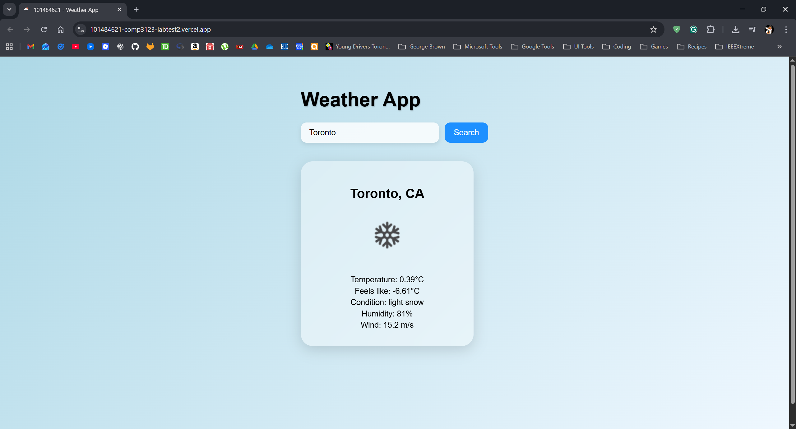
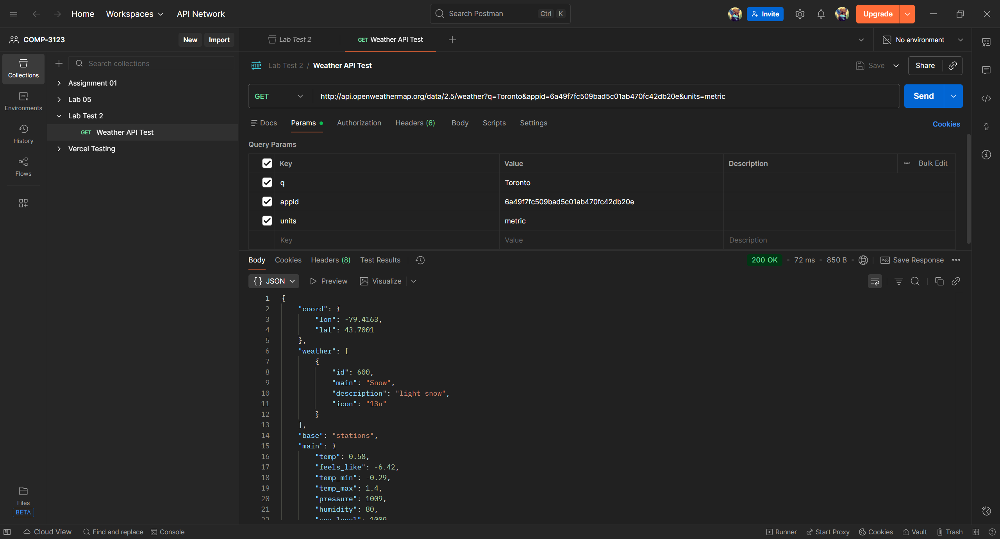

# COMP 3123 - Lab Test 02 - Weather App

This project's objective was to test my ability to use State and Effects components from React to fetch current weather data from openweathermap.org's API and display it in a user friendly way with search capabilities.

## Tech Stack
- **React (Create React App)**
- **JavaScript**
- **CSS**
- **OpenWeatherMap API**
- **Vercel (Deployment)**

## Vercel Deployment Link
https://101484621-comp3123-labtest2.vercel.app/

## Screenshots

### Vercel Deployed Weather App 

### Postman Test (Toronto)

